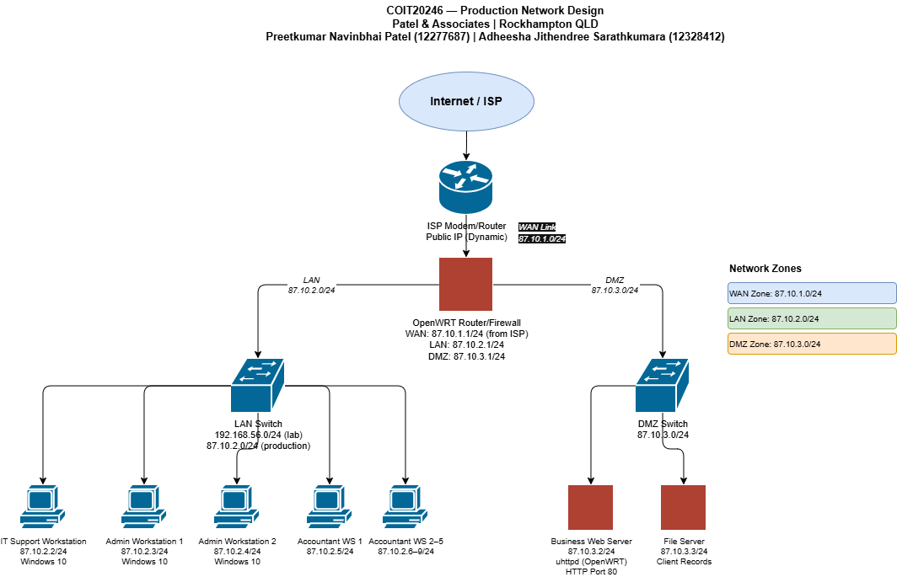

# Task 4.1 — Network Setup

## 4.1.1 Business Assumptions

The following assumptions were made to define the scenario. All technical decisions in this project depend on these assumptions.

| # | Assumption | Detail |
|---|---|---|
| 1 | **Location** | Rockhampton, Queensland, Australia. The business serves local clients in the Central Queensland region. |
| 2 | **Business Type** | Professional accounting and financial services firm providing tax returns, business accounting, financial planning, and payroll management to local individuals and small businesses. |
| 3 | **Number of Staff and Roles** | 8 staff total: 1 IT support officer (manages network and systems), 2 administrative staff (reception and office management), and 5 accountants (client-facing, handle financial data). All staff use Windows 10 workstations connected to the office network. |
| 4 | **Website Content** | The business website hosted on the router is a static HTML page containing: business name (Patel & Associates), services offered, office location in Rockhampton, and contact information. The website contains no client data, no login functionality, and no sensitive financial information — it is for public marketing purposes only. |

---

## 4.1.2 Network Setup

### Lab Network Overview

The lab network simulates a small business router/firewall using an OpenWRT 23.05.3 virtual machine running inside Oracle VirtualBox 7.x on a Windows 10 host machine. Two VirtualBox network adapters are used to create separate WAN and LAN interfaces, replicating how a real router connects to the internet and to the internal office network.

---

### Step 1 — OpenWRT VM Boot

OpenWRT was successfully installed and booted inside VirtualBox. The VM uses a converted `.vdi` disk image based on the official OpenWRT x86/64 release.

**Figure 1 — OpenWRT VM booted successfully in VirtualBox showing root shell**


*OpenWRT 23.05.3 booted in VirtualBox showing the root shell prompt, confirming the VM is fully operational.*

---

### Step 2 — Interface Identification

The following command was run to identify all network interfaces and their assigned IP addresses:

```bash
ip addr
```

**Figure 2 — OpenWRT network interfaces showing IP address assignments**


*Output of `ip addr` showing all OpenWRT interfaces: eth0 (WAN/NAT), eth1 (LAN/Host-only bridge member), and br-lan (LAN bridge).*

#### Interface Summary Table

| Interface | VirtualBox Adapter Type | IP Address | Subnet Mask | Role |
|---|---|---|---|---|
| eth0 | NAT | 10.0.2.15 | /24 (255.255.255.0) | WAN — connects OpenWRT to internet via host machine NAT |
| eth1 | Host-only | 192.168.56.101 | /24 (255.255.255.0) | LAN — physical virtual link between OpenWRT and Windows host |
| br-lan | Bridge (eth1 member) | 192.168.56.2 | /24 (255.255.255.0) | LAN bridge — logical LAN interface |
| Windows Host-Only Adapter | Host-only | 192.168.56.1 | /24 (255.255.255.0) | Windows side of the host-only virtual network |

**How the Windows host connects to OpenWRT:** VirtualBox creates a virtual network called the Host-Only network. The Windows host machine has a virtual network adapter (VirtualBox Host-Only Ethernet Adapter) with IP `192.168.56.1`. OpenWRT's eth1 is connected to this same virtual network with IP `192.168.56.101`, placing both devices on the `192.168.56.0/24` subnet. This allows the Windows host to SSH into OpenWRT and access the web server directly. The NAT adapter (eth0) provides OpenWRT with outbound internet access by routing traffic through the Windows host's physical Wi-Fi connection.

---

### Step 3 — Internet Connectivity Test

A ping test was performed from OpenWRT to Google's public DNS server (8.8.8.8) to confirm the WAN/NAT connection is functioning correctly.

**Figure 3 — OpenWRT confirming internet connectivity via NAT adapter**


*Successful ping from OpenWRT to 8.8.8.8 confirming internet access via the NAT adapter (eth0).*

---

### Step 4 — br-lan Reconfiguration

The br-lan interface was reconfigured to align with the VirtualBox Host-Only network subnet so that the Windows host could communicate with OpenWRT:

```bash
uci set network.lan.ipaddr='192.168.56.2'
uci set network.lan.netmask='255.255.255.0'
uci commit network
service network restart
```

**Figure 4 — OpenWRT br-lan reconfigured to align with VirtualBox Host-Only network**


*br-lan interface reconfigured to 192.168.56.2/24 matching the Host-Only network subnet.*

---

### Step 5 — Web Server Setup

The `uhttpd` web server (OpenWRT's built-in HTTP server) was installed and configured to host the business website:

```bash
opkg update
opkg install uhttpd
uci set uhttpd.main.listen_http='0.0.0.0:80'
uci commit uhttpd
service uhttpd restart
```

A static HTML page was created at `/www/index.html` containing the business name, both student names and IDs, and the current date.

**Figure 5 — uhttpd web server running and listening on port 80**


*uhttpd service running and confirmed listening on port 80 (HTTP) and port 443 (HTTPS).*

---

### Step 6 — Website Verification

The website was accessed from the Windows host browser at `http://192.168.56.101` to verify it was publicly accessible.

**Figure 6 — Business website accessible from Windows host browser showing student names and IDs**


*Business website for Patel & Associates displaying correctly in Windows browser, showing both student names, IDs, and the date.*

**Figure 7 — Business website HTML file content on OpenWRT**


*Contents of /www/index.html on OpenWRT confirming the HTML source code with student names and IDs.*

---

## 4.1.3 Firewall Rules

All firewall rules were implemented using **nftables**, which is the packet filtering framework used by OpenWRT 23.05.3. For each rule, before and after evidence is provided showing the changed behaviour.

---

### Rule 1 — Block and Allow HTTP (Port 80)

**Purpose:** Controlling HTTP access to the web server is a fundamental firewall function. Blocking port 80 prevents unauthorised external access to the web server. In a real deployment, HTTP might be blocked and only HTTPS allowed to enforce encrypted connections.

#### BEFORE — Website Accessible

Before any rule was applied, the website loaded successfully in the Windows browser at `http://192.168.56.101`.

#### Block HTTP — Rule Applied

The following nftables rule was added to drop all TCP traffic on port 80:

```bash
nft add table inet filter
nft add chain inet filter input { type filter hook input priority 0 \; policy accept \; }
nft add rule inet filter input tcp dport 80 drop
nft list ruleset
```

**Figure 8 — Firewall rule added to block HTTP traffic on port 80**


*nftables rule dropping all TCP traffic on port 80, confirmed with `nft list ruleset`.*

**Figure 9 — AFTER BLOCK: Website inaccessible after port 80 drop rule applied**


*Browser shows connection failed/timed out after the drop rule was applied, confirming HTTP is blocked.*

#### Allow HTTP — Rule Changed

The drop rule was removed and replaced with an accept rule:

```bash
nft flush table inet filter
nft add rule inet filter input tcp dport 80 accept
nft list ruleset
```

**Figure 10 — Firewall rule changed to allow HTTP traffic on port 80**


*nftables ruleset updated to accept TCP traffic on port 80.*

**Figure 11 — AFTER ALLOW: Website accessible again after port 80 accept rule applied**


*Website loading successfully in browser after the allow rule was applied.*

---

### Rule 2 — Allow SSH and Change Port (22 → 2222)

**Purpose:** SSH provides encrypted remote management access to the router. Changing SSH from the default port 22 to a non-standard port (2222) reduces automated brute-force attacks and port scanning that typically target port 22.

#### BEFORE — SSH Working on Port 22

**Figure 12 — BEFORE: Successful SSH connection on default port 22**


*Successful SSH connection from Windows host to OpenWRT on default port 22 before the port change.*

#### Change SSH Port to 2222

```bash
uci set dropbear.@dropbear[0].Port='2222'
uci commit dropbear
service dropbear restart
```

**Figure 13 — SSH port changed from 22 to 2222 via UCI configuration**


*UCI configuration showing dropbear SSH port changed from 22 to 2222.*

**Figure 14 — AFTER: SSH on port 22 refused after port change**


*SSH connection attempt to port 22 returns "Connection refused", confirming the port is no longer active.*

**Figure 15 — AFTER: Successful SSH connection on new port 2222**


*SSH connection on port 2222 succeeds, demonstrating the port change is working correctly.*

The SSH port was then restored to 22 after the demonstration to maintain management access.

---

### Rule 3 — Block and Allow ICMP (Ping)

**Purpose:** Blocking ICMP echo requests prevents external parties from discovering that the router is active via ping scanning. This is a basic network reconnaissance countermeasure. ICMP is re-enabled for legitimate internal network testing.

#### BEFORE — Ping Succeeds

**Figure 16 — BEFORE: Ping from Windows to OpenWRT succeeds before ICMP block**


*Successful ping from Windows host to OpenWRT (192.168.56.101) before any ICMP rule is applied.*

#### Block ICMP

```bash
nft flush table inet filter
nft add table inet filter
nft add chain inet filter input { type filter hook input priority 0 \; policy accept \; }
nft add rule inet filter input icmp type echo-request drop
nft list ruleset
```

**Figure 17 — Firewall rule added to block ICMP echo-request (ping)**

.png)

*nftables rule dropping ICMP echo-request packets.*

**Figure 18 — AFTER BLOCK: Ping from Windows times out after ICMP drop rule applied**


*Ping from Windows to OpenWRT shows "Request timed out" confirming ICMP is blocked.*

#### Re-enable ICMP

```bash
nft flush table inet filter
nft list ruleset
```

**Figure 19 — ICMP block rule removed, ping re-enabled**


*nft ruleset flushed, removing the ICMP block rule.*

**Figure 20 — AFTER RE-ENABLE: Ping from Windows to OpenWRT succeeds again**


*Ping succeeds again after the block rule was removed.*

---

### Rule 4 — Restrict Management Interface Access (Port 81)

**Purpose:** The web management interface (LuCI/uhttpd on port 81) provides full administrative control over the router. Restricting access to this port to only authorised IP addresses prevents unauthorised users on the network from accessing router management, reducing the risk of configuration tampering.

#### BEFORE — Port 81 Accessible

The uhttpd server was configured to also listen on port 81 for management interface demonstration:

```bash
uci set uhttpd.main.listen_http='0.0.0.0:81'
uci commit uhttpd
service uhttpd restart
```

**Figure 21 — BEFORE: Management web interface accessible on port 81**


*Management web interface accessible from Windows browser at http://192.168.56.101:81 before restriction.*

#### Apply Restriction Rule

```bash
nft flush table inet filter
nft add table inet filter
nft add chain inet filter input { type filter hook input priority 0 \; policy accept \; }
nft add rule inet filter input ip saddr != 192.168.56.1 tcp dport 81 drop
nft list ruleset
```

**Figure 22 — Firewall rule restricting management interface access on port 81**


*nftables rule dropping all TCP traffic to port 81 except from the authorised IP 192.168.56.1 (Windows host).*

**Figure 23 — AFTER: Management interface access restricted to authorised IP only**


*Access to port 81 is restricted. Only the authorised IP (192.168.56.1) can reach the management interface.*

The nftables ruleset was cleared after demonstration to restore normal operation:

```bash
nft flush ruleset
```

---

## 4.1.4 Network Diagrams

### Lab Network Diagram

The following diagram represents the actual VirtualBox lab setup used throughout this project.

**Figure 42 — Lab Network Diagram**


*Lab network diagram showing OpenWRT VM with eth0 (NAT, WAN) and eth1/br-lan (Host-only, LAN) connected to the Windows 10 host machine.*

#### Lab Network IP Address Allocation

| Device | Interface | Adapter Type | IP Address | Subnet | Role |
|---|---|---|---|---|---|
| OpenWRT VM | eth0 | NAT | 10.0.2.15 | /24 | WAN — internet via host NAT |
| OpenWRT VM | eth1 | Host-only | 192.168.56.101 | /24 | LAN physical link |
| OpenWRT VM | br-lan | Bridge (eth1) | 192.168.56.2 | /24 | LAN bridge interface |
| VirtualBox NAT Gateway | — | NAT | 10.0.2.2 | /24 | Default gateway for OpenWRT WAN |
| Windows 10 Host | Host-Only Adapter | Host-only | 192.168.56.1 | /24 | Windows side of host-only network |

---

### Production Network Design

The following diagram shows how the full business network would be designed for the actual Patel & Associates office premises. The lab setup simulates only part of this network (the router/firewall and one connected workstation).

**Figure — Production Network Diagram**



*Production network design for Patel & Associates showing the router/firewall, LAN workstations, DMZ web server, and internet connection.*

#### Production Network IP Addressing

IP addresses use **87** as the first octet, derived from the last two digits of Student 1's ID (12277**87**), as required by Section 4.1.5 of the project specification.

| Device | Interface | IP Address | Subnet Mask | Zone | Role |
|---|---|---|---|---|---|
| OpenWRT Router | WAN (eth0) | 87.10.1.1 | /24 (255.255.255.0) | WAN | Internet-facing interface |
| OpenWRT Router | LAN (eth1) | 87.10.2.1 | /24 (255.255.255.0) | LAN | Default gateway for staff workstations |
| OpenWRT Router | DMZ (eth2) | 87.10.3.1 | /24 (255.255.255.0) | DMZ | Default gateway for servers |
| IT Support Workstation | NIC | 87.10.2.2 | /24 | LAN | IT support staff |
| Admin Workstation 1 | NIC | 87.10.2.3 | /24 | LAN | Administrative staff |
| Admin Workstation 2 | NIC | 87.10.2.4 | /24 | LAN | Administrative staff |
| Accountant Workstation 1 | NIC | 87.10.2.5 | /24 | LAN | Accounting staff |
| Accountant Workstation 2 | NIC | 87.10.2.6 | /24 | LAN | Accounting staff |
| Accountant Workstation 3 | NIC | 87.10.2.7 | /24 | LAN | Accounting staff |
| Accountant Workstation 4 | NIC | 87.10.2.8 | /24 | LAN | Accounting staff |
| Accountant Workstation 5 | NIC | 87.10.2.9 | /24 | LAN | Accounting staff |
| Web Server | NIC | 87.10.3.2 | /24 | DMZ | Hosts public business website |
| File Server | NIC | 87.10.3.3 | /24 | DMZ | Stores client financial records |
| ISP Modem/Router | WAN | 87.10.1.254 | /24 | WAN | ISP-provided gateway |
